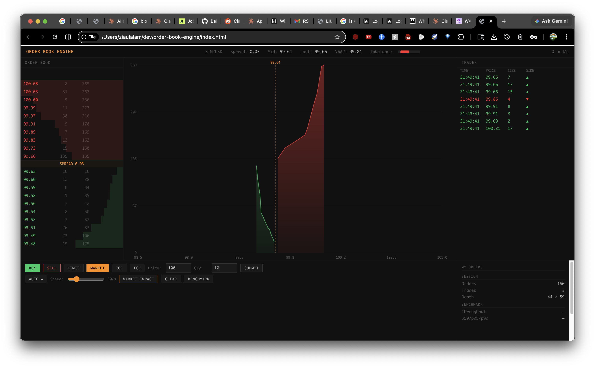

# Order Book Engine

Price-time priority matching engine with real-time depth visualization, invariant proofs, latency-distribution benchmarks, and market impact simulation. Runs entirely client-side.

**[Live Demo](https://ziaulalam1.github.io/orderbook/)** · 



```
node --test test/engine.test.mjs   # 13 invariants, ~80ms
```

---

## The Problem

Every exchange provides an environment where price-time priority exists; the highest priced order will be executed first. If two orders are to execute at the same price point, then the order submitted earliest will be executed next. Providing such a guaranteed environment allows investors to compete fairly. When this cannot be provided, some investor has either paid too much money for their position, or had to wait too long to buy or sell.

A good matching engine could provide evidence that the rules as defined by the exchange were followed, therefore providing a fair environment for all investors. Visualizing the order flow and the behavior of the order book in near-real time also demonstrates an understanding of market microstructure at the system level, rather than simply the programming interface.

## The Decision

The engine uses a price-time priority based matching algorithm. Four order types are supported, matching the time-in-force semantics used at real exchanges:

| Type | Behavior | Rests? | Rejection |
|------|----------|--------|-----------|
| **MARKET** | Cross the book at any price up to available liquidity | Never | `NO_LIQUIDITY` if opposite side empty |
| **LIMIT** | Match at limit-or-better; remainder rests on the book | Yes (remainder) | Never (always accepted, may not fill) |
| **IOC** (Immediate-or-Cancel) | Match at limit-or-better; remainder is killed, not rested | Never | Never (may report `cancelledQty`) |
| **FOK** (Fill-or-Kill) | All-or-nothing; pre-checks fillability at the limit before any execution | Never | `FOK_NOT_FILLABLE` if available qty < requested |

FOK is implemented as a non-mutating peek (`_fillableQtyBuy` / `_fillableQtySell`) before matching, which preserves the all-or-nothing guarantee under any partial-fill scenario.

The three views traders see: Level II Depth (L2); the depth chart; and the trade tape.

The most helpful part of this application is the "Market Impact" button. It triggers a 500 quantity market order into the order book and displays how a large order moves through various price levels, consumes available liquidity and affects the price. Slippage occurs when a market order cannot move through enough available shares on each trading level. Viewing this in near-real time is far more informative than reading about it in a book.

### Architecture decisions

| Decision | Reasoning |
|----------|-----------|
| Pure JS, no framework | Fixed UI structure. React adds bundle size and render overhead in the order processing loop. For 20 price levels and a Canvas chart, framework abstraction adds cost without value. |
| Array + splice, not binary heap | Verified: 1.1M orders/sec for <100 price levels. Heap would matter at >1000 levels. At 20 levels, cache-friendly linear scan beats pointer-chasing. |
| Client-side simulation, no server | Demonstrates the algorithm without infrastructure dependencies. A production exchange would use kernel bypass (DPDK/RDMA) and hardware timestamping. |
| No ML price prediction | Order matching is deterministic. Adding ML would obscure the matching semantics, which are the point. |
| Ornstein-Uhlenbeck order flow, not uniform random | Uniform random produces unrealistic flat price distributions. O-U mean-reverts around a fair price, producing realistic spread dynamics and occasional directional moves. |
| 30% market orders (vs ~10-15% in production) | Elevated ratio creates visible matching activity in the demo. Real equity markets have lower market order ratios because institutional execution is mostly limit-based. |

## What I'd Change

The simulation runs in interpreted JavaScript. A production matching engine would need:

- **Lock-free data structures** (compare-and-swap) for concurrent order submission from multiple gateways
- **Kernel bypass** (DPDK/RDMA) to eliminate OS network stack overhead -- real exchanges achieve sub-microsecond matching
- **UDP multicast** for market data distribution instead of DOM updates
- **FIX protocol** for standardized order entry (vs the internal API used here)
- **Hardware timestamping** (NIC-level) to guarantee ordering fairness, since software timestamps can jitter by microseconds

The order flow generator uses a simplified Ornstein-Uhlenbeck process. Real order flow has fat tails, volatility clustering (GARCH-like behavior), and informed/uninformed trader segmentation. A Hawkes process would model contagion effects more accurately.

## Invariant Tests

Run in CI on every push; locally with `node --test test/engine.test.mjs`. Also browser-based: open `tests/test_invariants.html`.

| # | Invariant | Assertion |
|---|-----------|-----------|
| 1 | Price-time priority | Given two sells at $100 (A, then B), a buy at $100 matches A first. Always. |
| 2 | No trade at worse price | Buy limit at $100 never executes against sell at $101. Sell at $99 matches at $100 (maker's price). |
| 3 | Conservation of shares | `resting + executed + cancelled == submitted`. No shares created or destroyed. The cancelled bucket accounts for IOC remainders, FOK rejects, MARKET partial fills against thin books, and MARKET rejects on empty opposite sides. |
| 4 | Book always sorted | After any sequence of operations, bids are strictly descending and asks are strictly ascending. |
| 5 | Empty book rejection | Market order against empty opposite side is explicitly rejected, not silently dropped. |
| 6 | IOC partial fill, never rests | IOC at price=101 against asks of 5@100 + 10@102: fills 5 (at-limit liquidity), reports `cancelledQty=7`, leaves no resting order. |
| 7 | FOK rejected when liquidity insufficient | FOK at price=101 qty=12 with only 5 fillable rejects with `FOK_NOT_FILLABLE`. Book unchanged: zero side-effects on rejection. |
| 8 | FOK fully fills when liquidity sufficient | FOK at price=101 qty=12 against asks of 5@100 + 10@101: fills 12 across both levels, no remainder. |
| 9 | Sell-side IOC mirrors buy-side | SELL IOC against BUY-side liquidity behaves symmetrically to test 6. |
| 10 | Sell-side FOK across multiple levels | SELL FOK at minPrice=98 spans two bid levels and fills 12. SELL FOK at minPrice=99 with only 5 fillable rejects. |
| 11 | Cancel removes a resting order | After `submitOrder` rests an order, `cancelOrder(id)` returns true and the book is empty. Repeat returns false (idempotent on missing id). |
| 12 | Auto-flow conservation | 5,000-order mixed-type stream (LIMIT + MARKET via O-U flow generator) preserves the conservation invariant under realistic flow. |

## Performance

Built-in benchmark (100,000 random limit orders):

| Metric | Value |
|--------|-------|
| Throughput | 1.1M orders/sec |
| p50 latency | <1 us |
| p95 latency | ~1 us |
| p99 latency | ~4 us |

Measured in V8 (Node.js/Chrome). The bottleneck in the browser demo is Canvas rendering, not matching.

## Transferable Pattern

A matching engine is one instance of a more general primitive: fair sequencing under contention. Any system where independent producers contend for shared resources, and where ordering must be both deterministic and defensible, ends up reaching for the same shape. Second-price ad auctions are a degenerate order book with one ask per impression and a tiebreaker on bid time. Lamport-ordered total broadcast in distributed systems is price-time priority with logical clocks standing in for prices. Fair queuing in multi-tenant schedulers is a continuous version of the same idea, weighting requests by deficit instead of price. The shared abstraction is a priority queue plus a domain-specific tiebreaker plus an audit trail proving the ordering rule was applied. Once you build one of these correctly, the next one is mostly choosing the right comparator.

## Running Locally

```
open index.html
```

No build step. No dependencies. No server.

## Tech

- JavaScript (ES6+), HTML5 Canvas, CSS Grid
- Zero dependencies
- Retina-aware Canvas rendering
- 60fps depth chart via requestAnimationFrame

## How AI Tooling Was Used

I used an AI coding assistant on parts of this build and not on others. It was useful for Canvas math, grid scaffolding, and boilerplate around the bench harness. The matching semantics (MARKET, LIMIT, IOC, FOK), the non-mutating fillability peek that gives FOK its all-or-nothing guarantee, the conservation invariant including the separate cancelled bucket, and the 13 invariant tests are all mine. Where I overruled the assistant: it suggested a binary heap for the price ladder, which I tested against array+splice and rejected because the level count is small and the cache locality of arrays wins; it suggested adding a price-prediction model, which I rejected because matching has to be deterministic and an ML layer obscures the semantics; it suggested Vitest, which I declined in favor of the Node built-in `--test` runner so the project keeps zero dependencies. A longer self-critique with specific failure modes I would flag in a code review of my own demo lives in [`INTERVIEW_QA.md`](./INTERVIEW_QA.md).
